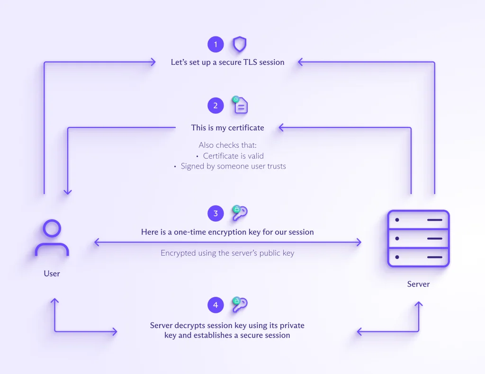

# Inception

I'm exploring system administration through Docker, virtualizing images in my personal VM for hands-on experience.

# Docker and VMs 
(Virtual Machines) are both virtualization technologies, but they work in fundamentally different ways. Here's a breakdown of their key differences:

## Level of Virtualization:

### Docker:
Works at the container level. It packages an application and its dependencies into a lightweight, portable unit called a container. Containers share the host operating system kernel, making them faster to start and use fewer resources.
### VM:
Works at the machine level. It creates a complete virtual machine with its own operating system, applications, and files. VMs are more isolated and secure but require more resources and take longer to boot up.

## Resource Usage:

### Docker:
 Lightweight and efficient. Containers share the host kernel, reducing resource overhead. Multiple containers can run on a single machine, maximizing resource utilization.
### VM:
 Resource-intensive. Each VM requires its own operating system, consuming more CPU, memory, and storage. Running multiple VMs can quickly deplete resources on a single machine.

## Isolation:

### Docker:
 Offers moderate isolation. Containers share the kernel but have their own user space, providing some isolation between applications. However, vulnerabilities in the kernel can affect all containers.
### VM:
 Offers high isolation. Each VM has its own operating system, creating a strong barrier between applications and the host machine. This isolation enhances security.

## Use Cases:

### Docker:
Ideal for microservices architectures, deploying multiple independent applications on a single server. It's also useful for development and testing environments where fast startup times and efficient resource usage are crucial.
### VM:
Better suited for running legacy applications that require specific operating systems or for situations where high security is paramount. VMs are also useful for running entire desktop environments or different operating systems altogether.

## Here's an analogy:

### Docker:
Imagine containers as separate apartments in a building. They share the building's infrastructure (electricity, water) but have their own independent spaces.
### VM:
Think of VMs as individual houses on a street. Each house has its own utilities, yard, and structure, offering a higher degree of isolation.
Choosing between Docker and VMs depends on your specific needs. If you require lightweight, portable environments for microservices or development, Docker is a great choice. If you need high isolation, security, or compatibility with specific operating systems, VMs might be a better fit.

# How does TLS work?

TLS uses public-key cryptography(new window) to verify the authenticity of a website. Every website that uses HTTPS (TLS) generates a mathematically related key pair:

A private key, which is kept secret and used to sign data
A public key, which anyone can use to verify that data
When your browser tries to connect to a website (a domain name like proton.me), the server creates a digital signature(new window) using the private key, which the browser verifies using the corresponding public key. If successful, this verification proves you’re connecting to a server that belongs to the domain name you’re visiting.

But how can your browser be sure the server’s public key really belongs to that domain? To solve this problem, TLS uses TLS certificates to help verify the identity of the server you’re connecting to.

What is a TLS certificate?
A TLS certificate is a type of digital certificate issued by a certificate authority (CA)(new window) to certify the ownership of a public key.

TLS certificates usually contain the following information:

The subject domain name (for example, proton.me)
The name of the issuing CA
Additional subject domain names, including subdomains, if any
The date of issue
The expiry date
The public key used to verify data (the subject organization keeps the private key secret)
The CA digitally signs(new window) the certificate, so if you trust the CA, you can be sure the public key belongs to the owners of the subject domain name.

How does a TLS certificate work?
When you try to connect to a website using HTTPS, the website server sends your browser its TLS certificate.

Your browser then verifies that the certificate is valid and digitally signed(new window) by a trusted CA by comparing it with information it stores about trusted CAs. This verification process uses public-key cryptography like RSA(new window) or ECC(new window) to prove the CA signed the certificate.

The signed certificate verifies the website server’s public key, which confirms that you’re communicating with the genuine server of the website you’re visiting, like https://proton.me, and not a hacker.

The server also authenticates a key exchange, resulting in a one-time session key that is used to send encrypted and authenticated data between the clients and the server.

In simplified terms, here’s how your browser and a website server establish a secure connection using a TLS certificate.

<!--add image im my assets-->



# How to create a self-signed certificate

```bash
openssl req -x509 -newkey rsa:4096 -keyout key.pem -out cert.pem -days 365
```

# How to create a self-signed certificate with a password

```bash
openssl req -x509 -newkey rsa:4096 -keyout key.pem -out cert.pem -days 365 -passout pass:your_password
```

# How to create a self-signed certificate with a password and a passphrase

```bash
openssl req -x509 -newkey rsa:4096 -keyout key.pem -out cert.pem -days 365 -passout pass:your_password -passin pass:your_passphrase
```

# How to create a self-signed certificate with a password and a passphrase and a subject

```bash
openssl req -x509 -newkey rsa:4096 -keyout key.pem -out cert.pem -days 365 -passout pass:your_password -passin pass:your_passphrase -subj "/C=US/ST=New York/L=New York/O=Example/OU=Example/CN=example.com"
```

# How to create a self-signed certificate with a password and a passphrase and a subject and a SAN

```bash
openssl req -x509 -newkey rsa:4096 -keyout key.pem -out cert.pem -days 365 -passout pass:your_password -passin pass:your_passphrase -subj "/C=US/ST=New York/L=New York/O=Example/OU=Example/CN=example.com" -addext "subjectAltName=DNS:example.com,DNS:www.example.com"
```

# How to create a self-signed certificate with a password and a passphrase and a subject and a SAN and a CA

```bash
openssl req -x509 -newkey rsa:4096 -keyout key.pem -out cert.pem -days 365 -passout pass:your_password -passin pass:your_passphrase -subj "/C=US/ST=New York/L=New York/O=Example/OU=Example/CN=example.com" -addext "subjectAltName=DNS:example.com,DNS:www.example.com" -CA ca.pem -CAkey ca-key.pem -CAcreateserial -CAserial ca.srl
```

# Mariadb

Open another terminal and keep the terminal with the compose running. On this other terminal, run the following command to enter in the mariadb container.

```sql
docker exec -it mariadb /bin/bash
```

Then run the command to enter in the mysql

```sql
mysql -u your_user -p db_name
```

Then run the command to see the tables

```sql
SHOW TABLES;
```

If you see the tables, it means that all is ok. If you want to see the database, run the following command:

```sql
SELECT * FROM table_name\G;
```

And if you want to delete a row in a table, run the following command:

```sql
DELETE FROM table_name WHERE column_name = some_value;
```

# DOCKER COMPOSE

Choosing between expose and ports:

Use ```expose``` : 
    when you want containers to communicate with each other on the same Docker network.
Use ```ports```  :  
    when you need to access a service running in a container from outside the Docker network, such as your local machine or the internet.
